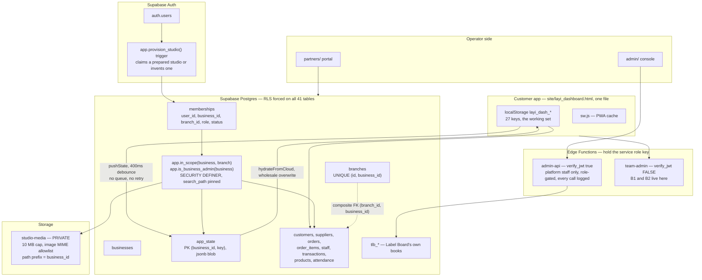

# The Label Board — architecture, security and SaaS readiness audit

**Date:** 23 September 2026
**Scope:** `site/`, `admin/`, `partners/`, `web/`, `supabase/`, and the live
Supabase project `eskubrbgbcbaejynjxvh`.
**Method:** source reading plus read-only queries against the live database and
the deployed Edge Functions. No production data was written, altered or deleted.
No destructive test was run.

**Working tree note.** `site/layi_dashboard.html` and `audit_invoice.js` had
uncommitted changes from a concurrent build session while this audit ran. The
findings below were read from the working tree as it stood. Nothing was changed.

---

## 1. EXECUTIVE SUMMARY

**Verdict: C — Beta ready. Not D, and not because of polish.**

Two live defects in one Edge Function let the owner of any studio take over or
destroy any account in the system, including other studios' owners and Label
Board platform staff. Until those are fixed the honest answer to *"is it ready
for multiple unrelated paying businesses"* is **no**, regardless of how good the
rest is.

And the rest is genuinely good. This is not a prototype wearing a SaaS costume.
Row level security is enabled **and forced** on all 41 public tables. Every
tenant table gates all four commands through one audited helper that reads real
membership rows. `INSERT` and `UPDATE` both carry `WITH CHECK`, so a record
cannot be created into, or moved into, another tenant. Branch references are
protected by composite foreign keys, which is the correct fix and one most teams
never reach. Storage is a private bucket with a MIME allowlist, a size cap, a
per-business path check and a quota. Plan limits are enforced by database
triggers, not by the browser. There are 54 front-end gates and 14 database
suites, and the RLS suite already builds two businesses with owner and staff
users and impersonates them properly.

The ceiling is not the tenant boundary. It is **granularity**. Almost all
operational data — orders, transactions, staff, payroll, the audit trail — is
stored as one JSON blob per business in `app_state`. The database can therefore
answer "does this user belong to this business" and nothing finer. Roles and
permissions exist only in the browser. A junior member of staff with a valid
login can read their employer's entire payroll and finances with one API call,
and there is no database rule that stops them. For a solo studio that does not
matter. For a studio with employees it is the product's main security gap.

Three more things are missing rather than broken: there is no error monitoring
of any kind, no staging environment, and no payment provider, so subscription
state is whatever an operator typed.

**Where it actually sits.** Safe today for one business per account with no
untrusted employees, once the two criticals are closed. Safe for many unrelated
paying businesses after P0 and P1 below.

---

## 2. LAUNCH BLOCKERS

| # | Finding | Risk | Evidence | Potential impact | Recommended fix |
|---|---|---|---|---|---|
| B1 | **`team-admin` `update` resets any user's password across tenants.** The profile update is scoped with `.eq('business_id', biz)`, but PostgREST returns no error when zero rows match, so `error` is null and execution continues to `admin.auth.admin.updateUserById(id, { password })` with an **unscoped** id. | **CRITICAL** | `supabase/functions/team-admin/index.ts:58-64`; deployed version confirmed byte-identical via `get_edge_function`, `status: ACTIVE`, version 1 | Any studio owner can set the password of any account in the system — another studio's owner, or a Label Board platform admin — then sign in as them. Full cross-tenant compromise and platform compromise. | Check the affected row count, or re-read the profile and confirm `business_id = biz` before touching auth. Reject otherwise. |
| B2 | **`team-admin` `delete` deletes any auth user across tenants.** `admin.from('profiles').delete()...` is scoped but its result is not checked at all, then `admin.auth.admin.deleteUser(id)` runs unconditionally. | **CRITICAL** | `supabase/functions/team-admin/index.ts:66-73` | Any studio owner can delete any account in the system, including platform staff. Denial of service and irreversible account loss. | Same: prove the profile belonged to the caller's business before calling `deleteUser`. |
| B3 | **Roles and permissions are enforced only in the browser.** `app.in_scope()` checks membership and status, never role or permission. All operational data sits in `app_state`, one row per business, so there is nothing finer to gate. | **HIGH** | `app.in_scope` definition (live DB); `pg_policies` for `app_state`; `site/layi_dashboard.html:2330` `STATE_KEYS` | Any active member — a machinist, a sales assistant — can `select * from app_state` and read the whole business: payroll, margins, every transaction. Hiding menu items does not stop this. | Split the finance and payroll keys out of the blob at minimum, and gate them on a role predicate in RLS. Long term, move the blob to real tables. |
| B4 | **Sync is last-write-wins with no queue, retry or conflict detection.** `pushState` is a 400 ms debounce that `console.warn`s on failure and discards the change. `hydrateFromCloud` overwrites local wholesale. | **HIGH** | `site/layi_dashboard.html:2331-2338` (`pushState`), `2461-2483` (`hydrateFromCloud`) | Two devices on one business silently overwrite each other's whole day. A failed push is lost with no user-visible sign. This is data loss, not inconvenience, and it is the kind customers leave over. | A durable outbox with retry, and per-key `updated_at` compare-and-set before overwriting. |
| B5 | **The audit trail is client-written and forgeable.** It is `layi_dash_audit` in localStorage, pushed inside the `app_state` blob. A user can edit or empty it from the console and push the result. | **HIGH** | `site/layi_dashboard.html:11746-11747`, `2330` | The audit trail cannot be used to answer "who deleted this" in any dispute, including a dispute with an employee. | Append-only table, written server side, no client `UPDATE` or `DELETE` policy. |
| B6 | **No error monitoring anywhere.** No Sentry or equivalent, and no `window.onerror` or `unhandledrejection` handler in the app. | **HIGH** | Grep across `site/ admin/ partners/ web/ supabase/`: 0 real hits; `window.onerror` count 0 in `site/layi_dashboard.html` | If saving orders began failing for 30% of users tonight, **you would find out when a customer told you.** Every failure in the sync path is a `console.warn` on the customer's own device. | Add a client error reporter and alerting on Edge Function 5xx. |
| B7 | **No staging environment.** One Supabase project, `eskubrbgbcbaejynjxvh`. Database suites run against PGlite from migrations, which is good, but there is nowhere to rehearse a restore, a migration, or a payment flow. | **HIGH** | `mcp list_projects` / `get_project`; `supabase/tests/*_harness.mjs` all use PGlite | Every migration and every Edge Function deploy is tested for the first time in production. A restore has never been rehearsed. | A second Supabase project as staging, seeded from migrations. |
| B8 | **No payment provider is integrated.** Config references Flutterwave and is explicitly off. Subscription state is whatever an operator typed in the console. | **HIGH** | `web/js/config.js:162` "OFF until the Flutterwave card step exists"; no webhook handler in `supabase/functions/` | Nothing verifies that a paying customer paid. There is no webhook, so no signature check, replay protection or idempotency to audit yet. | Build the provider integration with webhooks as the only writer of subscription state. |

---

## 3. ARCHITECTURE MAP



---

## 4. MULTI TENANCY VERDICT — **PASS at the business boundary**, risk **LOW**

**The tenant is the business.** `public.businesses` is the tenant root; every
tenant table carries `business_id`; `branches` are children with
`UNIQUE (id, business_id)`.

**Membership is the security fact.** `public.memberships (user_id, business_id,
branch_id, role, status)`. A user may hold rows in several businesses, so
multiple memberships are supported at the database level.

**Tenant context is never taken from the client.** Every policy calls
`app.in_scope(business_id, branch_id)`, which is `SECURITY DEFINER`, `STABLE`,
with `search_path` pinned to `public, pg_temp`, and which resolves the caller
from `auth.uid()` and requires `m.status = 'active'`. There is no path by which a
browser can assert a business id and be believed.

```sql
-- app.in_scope, read from the live database
select exists (
  select 1 from public.memberships m
  where m.user_id = auth.uid()
    and m.status = 'active'
    and m.business_id = p_business
    and (m.branch_id is null or p_branch is null or m.branch_id = p_branch)
);
```

**Revocation is immediate.** Because `status` is read on every policy
evaluation, setting a membership inactive locks the user out on their next query
without waiting for their JWT to expire. That is the correct design and it is
rarer than it should be.

**Cross-business branch references are impossible.** Six tables carry
`FOREIGN KEY (branch_id, business_id) REFERENCES branches(id, business_id)`.
The exact attack he asked about — `order.business_id = A` with
`order.branch_id` belonging to B — is rejected by the database.

**The caveat.** The app's *live* path writes almost nothing to those relational
tables. It writes `app_state`. So the strong model is real, and mostly unused.

---

## 5. RLS MATRIX

RLS is **enabled and forced** on all 41 tables in `public`. `forced` matters:
even the table owner is subject to policy.

### Tenant-owned tables reached by the app

| Table | Tenant key | RLS | SELECT | INSERT | UPDATE | DELETE | Risk |
|---|---|---|---|---|---|---|---|
| `app_state` | `business_id` | forced | `in_scope(b, null)` | `WITH CHECK in_scope` | qual + `WITH CHECK` | `in_scope` | **HIGH** — holds everything; no role or branch granularity possible |
| `orders` | `business_id` + `branch_id` | forced | `in_scope(b, br)` | `WITH CHECK` | qual + `WITH CHECK` | `in_scope` | LOW |
| `order_items` | `business_id` | forced | `in_scope(b, null)` | `WITH CHECK` | qual + `WITH CHECK` | `in_scope` | LOW |
| `customers` | `business_id` + `branch_id` | forced | `in_scope` | `WITH CHECK` | qual + `WITH CHECK` | `in_scope` | LOW |
| `transactions` | `business_id` + `branch_id` | forced | `in_scope` | `WITH CHECK` | qual + `WITH CHECK` | `in_scope` | **MEDIUM** — finance readable by any member |
| `staff` | `business_id` + `branch_id` | forced | `in_scope` | `WITH CHECK` | qual + `WITH CHECK` | `in_scope` | **MEDIUM** — pay readable by any member |
| `attendance` | `business_id` + `branch_id` | forced | `in_scope` | `WITH CHECK` | qual + `WITH CHECK` | `in_scope` | LOW |
| `products` | `business_id` | forced | `in_scope` | `WITH CHECK` | qual + `WITH CHECK` | `in_scope` | LOW |
| `suppliers` | `business_id` | forced | `in_scope` | `WITH CHECK` | qual + `WITH CHECK` | `in_scope` | LOW |
| `branches` | `business_id` | forced | `in_scope(b, id)` | `is_business_admin` | `is_business_admin` ×2 | `is_business_admin` | LOW — admin-gated correctly |
| `memberships` | `business_id` | forced | self **OR** `is_business_admin` | `is_business_admin` | `is_business_admin` ×2 | `is_business_admin` | LOW — self-elevation blocked |
| `businesses` | `id` | forced | `in_scope(id, null)` | `is_business_admin` | `is_business_admin` ×2 | *(no DELETE policy — deny)* | LOW |
| `profiles` | `business_id` | forced | `in_scope` | *(none — deny)* | self only, `WITH CHECK` id + in_scope | *(none — deny)* | LOW |
| `feedback`, `feedback_replies` | `business_id` | forced | `in_scope` | `WITH CHECK` | *(deny)* | *(deny)* | LOW — write-once by design |

### Deny-all by design (RLS on, zero policies — service role only)

`enquiries`, `payment_methods`, `plan_state_keys`, `platform_admins`,
`platform_audit`, `referral_attempts`, `tlb_trial_history`.

**One thing to fix here.** `platform_admins` has RLS enabled with zero policies,
so it is deny-all today — but `authenticated` still holds `SELECT` and `INSERT`
**grants** on it. The grant is masked by RLS and is harmless right now. It
becomes privilege escalation to platform admin the moment anyone adds a
permissive policy or disables RLS during debugging. Revoke the grant so the
table is safe twice over. **MEDIUM.**

### Read-only catalogues (SELECT policy only)

`plan_limits`, `plan_features`, `plan_feature_catalogue`, `partner_rate_bands`,
`partner_ledger`, `partner_payouts`, `partner_referrals`, `tlb_audit_log`.
Correct: the client may read the rules, only the server writes them.

---

## 6. ROLES AND PERMISSIONS VERDICT — **FAIL**, risk **HIGH**

**Status: FAIL.** Not because the UI is wrong, but because nothing behind it is
enforced.

- `memberships.role` exists and is used, but **only** by `app.is_business_admin`
  (`owner` or `manager`), and that function is used only on `branches`,
  `memberships` and `businesses`.
- No policy anywhere references a permission. There is no permission table.
- The app's roles and permissions live in `layi_dash_roles` and `layi_dash_users`
  — inside the `app_state` blob the user can read and write.

**The concrete bypass.** A signed-in member of any role, using the anon key and
their own session, runs:

```
POST /rest/v1/app_state?select=key,data&business_id=eq.<their own business>
```

and receives every key: `layi_dash_txns`, `layi_dash_staff` with salaries,
`layi_dash_audit`, `layi_dash_settings` with bank details. `in_scope` returns
true because they are an active member. There is no role check to fail.

They can equally `upsert` the blob back with a modified audit trail, a changed
salary or a deleted order. `WITH CHECK` confirms only that the business id is
still theirs.

**So, against his test list:** a user without Finance permission **can** retrieve
finance records directly. A user without Staff Management **can** change another
employee. A user without Delete **can** delete records. All three fail at the
database, and the UI hiding the buttons is exactly the situation he warned
against.

**Not a flaw in the RLS design — a flaw in the data shape.** You cannot write a
row-level policy about payroll when payroll is one field of one JSON document
that also contains the order list.

---

## 7. LOCAL DATA / CLOUD SYNC VERDICT — **PARTIAL**, risk **HIGH**

**localStorage is the source of truth. Supabase is a replica.** Every read in
the app goes to `load()`. Writes go to `save()`, which calls `syncPush()`.

**What syncs, and how**

| Data | Path | Shape |
|---|---|---|
| customers | `pushCustomers` / `pullCustomers` | real `customers` table |
| suppliers | `pushSuppliers` / `pullSuppliers` | real `suppliers` table |
| feedback | `pushFeedback` | real `feedback` table, **with a retry queue** |
| **21 other keys** — orders, orders_done, txns, appts, staff, users, roles, products, supplies, bills, pots, tasks, anns, attendance, leave, shifts, campaigns, log, **audit**, settings, planner | `pushState` / `hydrateFromCloud` | **one jsonb blob per key** in `app_state` |

**When it happens.** Push: 400 ms after any `save()`, if `liveMode`. Pull: on
login, or the manual Sync button. `site/layi_dashboard.html:2318-2321` says
plainly *"Realtime is not on yet — other devices pull on login or via Sync."*

**Answers to his questions, from the code**

- **Sync failure:** `console.warn` and the change is dropped. Nothing retries it,
  nothing tells the user. (`pushState`, line 2337)
- **Retry / queue:** none on the main path. Only `pushFeedback` queues on
  `!f.sentAt` (line 2285).
- **Conflict resolution:** none. Last push wins the whole key.
- **Versioning:** `updated_at` is written but never compared on the way in.
- **Are timestamps reliable?** No. `new Date().toISOString()` from the client
  clock. A device with a wrong clock silently wins or loses every conflict.
- **Two devices:** unsafe. Device B's login calls `hydrateFromCloud`, which does
  `saveLocal(r.key, r.data)` for every key — **overwriting local wholesale**,
  with no merge and no prompt.
- **Both edit the same order:** whoever saves last replaces the other's entire
  order list. The other day's work is gone with no error.
- **Cache cleared / device lost:** in live mode, everything that reached
  `app_state` comes back on next sign-in. Anything pending at the moment of the
  clear is gone. In local-only mode, everything is gone unless a backup file was
  taken.
- **Can cloud restore the app?** Yes for a live studio, to the last successful
  push. There is no way to know what that was.

**The claims mismatch — FAIL, risk MEDIUM**

`site/layi_dashboard.html:1564` tells a signed-in live studio:

> "Your data lives only in this browser, so back it up regularly."

That is false for anyone signed in with email and password, whose data is in
`app_state` in Supabase. It is true for demo and PIN logins. One sentence is
shown to both. `web/privacy.html` makes no cloud claim either way, so the gap is
between the app's own words and its own behaviour rather than the marketing
site. Fix the copy to depend on `liveMode`.

---

## 8. STORAGE SECURITY VERDICT — **PASS**, risk **LOW**

| Bucket | Public | Purpose | Upload | Download | Update | Delete | Tenant isolation | Risk |
|---|---|---|---|---|---|---|---|---|
| `studio-media` | **private** | order and client photos | `in_scope(media_business_of(name))` **and** `storage_has_room(...)` | `in_scope(media_business_of(name))` | qual + `WITH CHECK`, both on `media_business_of(name)` | `in_scope(media_business_of(name))` | path prefix is the business id, resolved server side | LOW |

One bucket, private, `file_size_limit` 10485760 (10 MB), `allowed_mime_types`
restricted to webp, jpeg, png, gif, heic, heif. Signed URLs via
`createSignedUrls` with a TTL (`site/layi_dashboard.html:7676`).

**Path traversal into another business fails.** The policy derives the business
from the object name with `app.media_business_of(name)` and passes it through
`in_scope`. Uploading to `B/whatever.jpg` evaluates `in_scope(B)` and is refused.
The `UPDATE` policy carries a `WITH CHECK` on the **new** name, so renaming a
file into another business's prefix is refused too — the case most
implementations miss.

A storage quota is enforced at insert (`app.storage_has_room`), with
`media_usage_sync` keeping usage current by trigger.

**Not verified:** whether any signed URL TTL is long enough to matter if leaked,
and whether image EXIF (including GPS) is stripped on upload. Both LOW.

---

## 9. SUBSCRIPTION & PAYMENT VERDICT — subscriptions **PASS**, payments **FAIL**

**Subscriptions and plan limits: PASS, risk LOW.** This is the part that
surprised me most, in a good way. Limits are enforced by **database triggers**,
not by the browser:

| Trigger | Table | Enforces |
|---|---|---|
| `branches_plan_limit` | `branches` | `app.enforce_branch_limit()` — studio count |
| `memberships_plan_limit` | `memberships` | `app.enforce_seat_limit()` — login count, on INSERT **and UPDATE** |
| `app_state_plan_feature` | `app_state` | `app.enforce_state_feature()` |
| `staff_plan_feature` | `staff` | `app.enforce_payroll_feature()` |
| `suppliers_plan_feature`, `attendance_plan_feature` | | `app.enforce_table_feature(...)` |

So his exact test — "attempt to create Studio 2 directly through the API on a
plan that allows 1" — is rejected by Postgres, not by a hidden button.
`plan_limits_harness` and `plan_feature_harness` already prove both the refusal
and the success after upgrade, which is the right way to test a rule.

Subscription state lives in `tlb_subscriptions` joined to `tlb_customers` by
`business_id`, so it belongs to the **business**, not the user. `plan_tier`,
`billing_cycle`, `monthly_equivalent_price`, `start_date`, `renewal_date`,
`is_trial`, `trial_end_date`, `is_active`. `app.set_studio_plan()` writes both
books in one transaction so the app's gate and the invoice cannot disagree.

**Payments: FAIL, risk HIGH.** There is no payment provider integrated at all.
No checkout, no webhook endpoint, no signature verification, no idempotency key,
no replay protection — because there is nothing to protect yet. `web/js/config.js`
says the card step is *"OFF until the Flutterwave card step exists"*.

Subscription state is therefore set by an operator in the console through
`admin-api`'s `setPlan`, which is authenticated, role-gated to `owner`/`finance`
and logged. That is sound for a manual business. It is not a billing system, and
every item on his payments checklist is **NOT APPLICABLE until the provider
exists** — at which point all of it needs building and testing at once.

---

## 10. BACKUPS / DISASTER RECOVERY VERDICT — **CANNOT VERIFY**, risk **HIGH**

**What I can prove:** the organisation is on the Supabase **Pro** plan
(`get_organization`), and the project is `ACTIVE_HEALTHY`, Postgres 17.6,
region `eu-west-2`.

**What I cannot prove from here:** backup frequency, retention, and whether
point-in-time recovery is enabled. No MCP tool exposes backup configuration, and
it is not in any migration. **CANNOT VERIFY — check Database → Backups in the
dashboard.** On Pro, daily backups are included and PITR is a paid add-on; if it
has not been purchased, recovery granularity is one day.

**What certainly does not exist:**

- No restore has ever been rehearsed, because there is nowhere to rehearse it.
- No disaster recovery document anywhere in the repo.
- No separate backup of Storage. Objects are not covered by a database backup.
- No soft-delete on any tenant table, and no `deleted_at` column.

**"If the production database was damaged today, what is the recovery process?"**
Restore the most recent Supabase backup from the dashboard, losing everything
since it was taken, and hope Storage is intact because it is backed up
separately or not at all. That process has never been tested. **This is the
weakest area in the audit and it is invisible until the day it matters.**

**"If one business deletes 500 orders, what are the options?"** Today: none that
do not also roll back every other business. Their orders were one key of one
`app_state` row, overwritten in place; the previous value is not kept. A
full-database restore to recover one tenant's mistake would discard every other
tenant's work since that point. **This is a foreseeable support ticket with no
acceptable answer.**

**Safe restore test to run in staging, never here:** restore a snapshot into a
fresh project, run all 14 harnesses against it, sign in as a seeded studio,
confirm `app_state` hydrates, and time the whole thing. The number you want is
the wall clock, because that is your real RTO.

---

## 11. SECURITY FINDINGS

| Area | Status | Risk | Evidence |
|---|---|---|---|
| Broken access control (cross-tenant, DB) | **PASS** | LOW | Every tenant policy gates on `app.in_scope`; `rls_harness` 71 checks |
| Broken access control (Edge Function) | **FAIL** | **CRITICAL** | B1, B2 — `team-admin/index.ts:58-73` |
| Privilege escalation, tenant → platform | **FAIL** | **CRITICAL** | B1 lets a tenant owner reset a platform admin's password |
| Privilege escalation, member → owner | **PASS** | LOW | `memberships` INSERT/UPDATE require `is_business_admin` |
| Privilege escalation, member → finance | **FAIL** | **HIGH** | B3 — no role check on `app_state` |
| IDOR | **PARTIAL** | HIGH | Safe on tables; `team-admin` takes an unvalidated `id` |
| SQL injection | **PASS** | LOW | No string-built SQL in the clients; PostgREST is parameterised; all `SECURITY DEFINER` functions pin `search_path` |
| XSS | **PASS** | LOW | 623 `esc()` calls against 212 `innerHTML`; the one unescaped interpolation (`:6080`) is a plain-text WhatsApp template, not HTML |
| Unsafe file upload | **PASS** | LOW | MIME allowlist and 10 MB cap at the bucket |
| Edge Function authentication | **PARTIAL** | MEDIUM | `admin-api` `verify_jwt: true` and role-gated; `team-admin` `verify_jwt: false` — it does call `getUser()` so it is not open, but the platform gate is off |
| Service role key exposure | **PASS** | LOW | Zero hits in `site/ admin/ partners/ web/`; used only inside the two Edge Functions from `Deno.env` |
| Secrets in the repo | **PASS** | LOW | No `.env` tracked; `admin/js/credentials.js` is a PBKDF2 demo-login store, not a secret |
| Plaintext password handling | **FAIL** | MEDIUM | `team-admin` `create` and `update` accept a password from the browser — contradicting `admin-api`'s own rule that *"nobody is ever sent a password"* |
| Rate limiting / brute force | **CANNOT VERIFY** | MEDIUM | Supabase Auth has built-in limits; nothing app-side. `admin/js/credentials.js` has a lockout, but that is the local demo path |
| Leaked password protection | **FAIL** | MEDIUM | Advisor `auth_leaked_password_protection`: disabled |
| Sensitive data in logs | **PASS** | LOW | `platform_audit` records action and business, not payloads of customer data |
| Dependency vulnerabilities | **NOT APPLICABLE** | INFO | The customer app has no build step and no dependencies. Edge Functions import `@supabase/supabase-js@2` from esm.sh — unpinned to a patch version, MEDIUM for supply chain |
| `anon` can execute `SECURITY DEFINER` functions | **PARTIAL** | MEDIUM | Advisor flags `submit_enquiry` (intended — the public contact form) and six `my_*` functions for `authenticated` (intended — each scopes to the caller). Reviewed, no action, but they should stay on the list |

---

## 12. ENVIRONMENT / DEPLOYMENT VERDICT — **FAIL**, risk **HIGH**

**Deployment is genuinely well separated.** Four Netlify sites from two
branches, on purpose, so one bad release cannot take all four down:

| Branch | Publishes | Sites |
|---|---|---|
| `main` | `site/`, `web/` | app.thelabelboard.com, thelabelboard.com |
| `admin-deploy` | `admin/`, `partners/` | admin.thelabelboard.com, partners.thelabelboard.com |

Verified live: all four return 200 and each serves its own app.

**Environments are not separated at all.** One Supabase project serves
development, testing and production. There is no staging project, no test
payment environment, no test storage, no separate keys.

**Are developers testing against production data?** Partly, and honestly so.
The 14 database harnesses run against PGlite built from the migrations, which is
the right pattern and means schema changes are tested in isolation. But
**Edge Functions and Auth have no such harness**, so `team-admin` and
`admin-api` are only ever exercised against the live project — which is exactly
why B1 and B2 survived.

**Minimum safe architecture:** one staging Supabase project seeded from
migrations, Edge Functions deployed there first, a Netlify deploy preview
pointed at it, and production credentials that exist nowhere but production.

---

## 13. TEST COVERAGE TODAY

**Substantial, and better than most projects this size.** 54 front-end gates and
14 database suites.

**Already tested, and well**

- **Tenant isolation at the database.** `rls_harness.mjs` builds Studio A and
  Studio B with owner and staff users, impersonates them the way Supabase does
  (`set local role authenticated` with `request.jwt.claims`), and asserts reads
  and writes cannot cross (`:151-176`, `:288`, `:331-336`). 71 checks. **This is
  his "mandatory tenant isolation test" and it substantially exists already.**
- Partner isolation (`partner_rls_harness`, 82), storage isolation
  (`storage_rls_harness`, 76), feedback isolation, `tlb_` isolation against
  Supabase's real default grants (`tlb_policy_harness`, 100).
- Plan limits and feature gates, proving both refusal **and** success after
  upgrade.
- Onboarding, billing, commission, referral fraud, trial.
- A fresh database built from migrations alone actually runs the app
  (`app_schema_harness`, 111).
- Front end: console click-through of every handler, safe areas, offline, print,
  permissions UI, branch scope.

**Not tested at all**

| Gap | Why it matters |
|---|---|
| **Edge Functions** | Zero tests. B1 and B2 are both there |
| **Auth flows** | No test of expiry, revocation, deleted user, reused invitation |
| **Sync and conflict** | `audit_offline.js` checks the UI, not two devices racing |
| **Role enforcement at the API** | Nothing asserts a staff member is refused finance |
| **Restore** | Never rehearsed |
| **Performance at scale** | No test above demo data volumes |
| **Payments** | Nothing to test yet |

---

## 14. REQUIRED TEST SUITE

| ID | Area | Test | Auto/Manual | Priority | Status today | Expected result |
|---|---|---|---|---|---|---|
| T01 | Edge Fn | `team-admin update` with a **foreign** profile id + password | Auto | **P0** | **missing** | 403; password unchanged |
| T02 | Edge Fn | `team-admin delete` with a foreign id | Auto | **P0** | **missing** | 403; auth user still exists |
| T03 | Edge Fn | `team-admin` with a platform admin's id | Auto | **P0** | missing | 403 |
| T04 | Edge Fn | `team-admin` unauthenticated and with a forged JWT | Auto | P0 | missing | 401 |
| T05 | Edge Fn | `admin-api` as a tenant user | Auto | P0 | missing | 403 "not a Label Board staff account" |
| T06 | Edge Fn | `admin-api` as `support` calling `partnerCommission` | Auto | P1 | missing | 403 by role map |
| T07 | Perms | A-staff `select app_state` where business = A | Auto | **P0** | missing | **currently succeeds — must fail after B3** |
| T08 | Perms | A-staff `update` staff salary via REST | Auto | P0 | missing | refused |
| T09 | Perms | A-staff `delete` an order via REST | Auto | P0 | missing | refused |
| T10 | Tenant | A-owner reads B's `app_state` | Auto | P0 | **covered** (`rls_harness`) | refused |
| T11 | Tenant | A-owner inserts with `business_id = B` | Auto | P0 | **covered** | refused by `WITH CHECK` |
| T12 | Tenant | A-owner updates an A row to `business_id = B` | Auto | P0 | **covered** | refused |
| T13 | Tenant | Repeat T10–T12 for all 14 tenant tables | Auto | P0 | partial | all refused |
| T14 | Integrity | Insert order with A's business and B's branch | Auto | P1 | **covered by FK** | rejected |
| T15 | Storage | A uploads to `B/x.jpg` | Auto | P0 | **covered** | refused |
| T16 | Storage | A renames its file into B's prefix | Auto | P1 | partial | refused by `WITH CHECK` |
| T17 | Storage | A lists and downloads B's objects | Auto | P0 | **covered** | empty / refused |
| T18 | Auth | Membership set inactive mid-session | Auto | P0 | missing | next query refused, no re-login needed |
| T19 | Auth | Deleted user's unexpired JWT | Auto | P1 | missing | refused |
| T20 | Auth | Invitation reused after claiming | Auto | P1 | missing | refused |
| T21 | Auth | Role changed mid-session | Auto | P1 | missing | new role applies on next query |
| T22 | Plan | Create branch 2 on a 1-branch plan via REST | Auto | P0 | **covered** | trigger raises |
| T23 | Plan | Create seat 6 on a 5-seat plan via REST | Auto | P0 | **covered** | trigger raises |
| T24 | Plan | Write a Pro feature on Basic via REST | Auto | P0 | **covered** | trigger raises |
| T25 | Sync | Create offline, reconnect | Manual→Auto | P0 | missing | record reaches `app_state` |
| T26 | Sync | Edit on A, edit same on B, both sync | Manual | **P0** | missing | **currently loses one side** |
| T27 | Sync | Push fails (offline mid-write) | Auto | P0 | missing | queued, retried, user informed |
| T28 | Sync | Device offline 24h then reconnects | Manual | P0 | missing | merge, not clobber |
| T29 | Sync | Membership revoked while offline | Manual | P1 | missing | push refused, data retained locally |
| T30 | Sync | Storage cleared mid-sync | Manual | P1 | missing | cloud state recoverable |
| T31 | Audit | Client forges an audit entry and pushes | Auto | P1 | missing | refused once append-only |
| T32 | DR | Restore snapshot to staging, run 14 harnesses | Manual | **P0** | missing | green; RTO measured |
| T33 | DR | Recover one tenant's deleted orders | Manual | P0 | missing | possible without touching others |
| T34 | Perf | 10k customers, 100k orders in `app_state` | Auto | P1 | missing | measure blob size and hydrate time |
| T35 | Perf | Login hydrate time at each volume | Manual | P1 | missing | acceptable on a mid-range phone |
| T36 | Error | Supabase unreachable during save | Manual | P0 | missing | user told, retry offered, nothing lost |
| T37 | Pay | Every payments test | Auto | P2 | N/A | build with the provider |

---

## 15. TESTS I CAN SAFELY RUN NOW

Non-destructive, against the existing harness infrastructure, with no
production writes:

1. **T01–T06, Edge Function authorisation** — build a local harness that calls
   the functions with crafted bodies against a **staging** project. Against
   production I can only prove B1 and B2 by reading the code, which I have.
2. **T07–T09, role enforcement** — extend `rls_harness.mjs`, which already has
   A-staff. These run against PGlite and will fail today, which is the point.
3. **T13, the full tenant grid** — extend the existing 71 checks to all 14
   tenant tables mechanically.
4. **T14, the branch/business cross-reference** — one insert in PGlite.
5. **T16, storage rename into another prefix** — extend `storage_rls_harness`.
6. **T18, T21, membership revocation and role change mid-session** — PGlite,
   using the existing JWT impersonation helper.
7. **T31, forged audit entry** — PGlite, once the table exists.
8. **T34, blob size at volume** — generate 100k synthetic orders locally and
   measure the JSON size and parse time. No production contact.

All eight extend harnesses that already exist and run in node against PGlite.

## 16. TESTS THAT REQUIRE STAGING

- **T01–T06** end to end against real deployed Edge Functions.
- **T19, T20** — deleted users and invitation reuse need real Supabase Auth.
- **T25–T30** — real offline behaviour needs a real browser and a real backend.
- **T32, T33** — restore drills. **Never against production.**
- **T35** — hydrate timing against a real network.
- **T36** — failure injection.
- **T37** — payments, in the provider's test mode.

---

## 17. REMEDIATION PLAN

### P0 — before any external paying customer

1. **Fix `team-admin` `update` and `delete`** (B1, B2). Confirm the profile
   belongs to the caller's business before touching `auth.admin`. Two guards.
2. **Audit the blast radius.** Query `platform_audit` and Supabase auth logs for
   unexpected password changes or user deletions. The function has been live
   since 3 May 2026 at version 1.
3. **Turn `verify_jwt` on for `team-admin`.**
4. **Stop accepting passwords from the browser.** Use the invitation flow
   `admin-api` already implements.
5. **Regression tests T01–T05** so neither can return.
6. **Split finance and payroll out of `app_state`** and gate them on a role
   predicate — the smallest change that closes B3.
7. **Revoke `authenticated` grants on `platform_admins`.**
8. **Turn on leaked password protection.**

### P1 — before wider launch

9. **A durable sync outbox** with retry and a visible sync state (B4).
10. **Compare-and-set on `app_state`** using `updated_at`, refusing a stale
    overwrite, so two devices cannot silently clobber (T26).
11. **Move the audit trail to an append-only table** (B5).
12. **A staging Supabase project** (B7).
13. **Error monitoring and alerting** (B6).
14. **Fix the "only in this browser" copy** to depend on `liveMode`.
15. **Rehearse a restore** and write down the RTO (T32).
16. **Per-tenant recovery** — soft delete or a periodic per-business snapshot
    (T33).
17. **Tenant grid to all 14 tables** (T13).

### P2 — scaling and security

18. **Move `app_state` to real tables**, key by key, starting with orders and
    transactions. This unlocks branch scoping, per-record permissions, real
    audit and pagination. It is the biggest piece of work here and everything
    above is chosen to be useful whether or not it happens.
19. **Payments** with webhooks as the sole writer of subscription state.
20. **A timezone and locale model** per business. 78 hardcoded `en-GB`
    formatters and zero timezone handling today.
21. **Pin the Edge Function `supabase-js` import** to an exact version.
22. **Performance work** — pagination and indexes, once tables exist.

### P3 — future

23. Platform analytics, privacy-conscious.
24. AI assistant architecture (section 23 below).
25. MFA for owners and all platform admins.

---

## 18. RECOMMENDED IMPLEMENTATION ORDER

**Phase 1 — close the two holes.** `team-admin`, plus the blast-radius check and
T01–T05. Days, not weeks. Nothing else should start first.

**Phase 2 — see what is happening.** Error monitoring, then a staging project.
Every later phase is safer once these exist, and Phase 1 proves why: a function
with no tests and no monitoring carried a critical flaw for four months.

**Phase 3 — stop losing data.** The sync outbox, compare-and-set, the visible
sync state, the honest copy. This is the one customers will feel.

**Phase 4 — make permissions real.** Finance and payroll out of the blob first,
because that is where the damage is, then the rest key by key.

**Phase 5 — be able to recover.** Restore drill, per-tenant recovery,
append-only audit.

**Phase 6 — payments, then scale.**

The order is deliberate: security holes, then the ability to detect, then data
integrity, then permissions, then recovery. Permissions come after sync because
a silent data loss bug hurts every customer every day, while the permission gap
hurts only studios with untrusted staff.

---

## 19. WHAT NOT TO CHANGE

Genuinely good, and rebuilding it would be a waste:

1. **The RLS model.** `app.in_scope` and `app.is_business_admin` are correct:
   `SECURITY DEFINER`, `STABLE`, `search_path` pinned, resolving identity from
   `auth.uid()` and checking `status = 'active'`. RLS forced on all 41 tables,
   `WITH CHECK` on every INSERT and UPDATE. **Do not touch this.**
2. **The composite branch foreign key.** `(branch_id, business_id) REFERENCES
   branches(id, business_id)` is the right answer to a problem most teams solve
   with a trigger or not at all.
3. **The storage design.** Private bucket, server-derived business from the
   path, MIME allowlist, size cap, quota at insert, `WITH CHECK` on rename.
4. **Plan limits as database triggers.** Unbypassable from the client, and
   tested both ways.
5. **`admin-api`'s shape.** JWT verified, `platform_admins` checked, per-role
   action allowlist, every call logged including reads.
6. **The migrations discipline.** Everything created by a migration, applied in
   filename order, with a harness proving a fresh database runs the app.
7. **The four-site deployment split.**
8. **The harness culture.** 68 gates and suites, mutation-tested. It is why this
   audit could prove things rather than guess.

---

## 20. QUESTIONS FOR YOU

Only the ones the code cannot answer:

1. **Is point-in-time recovery enabled on the Supabase project, and what is the
   backup retention?** Not visible through any tool I have. Database → Backups.
2. **Is Storage backed up anywhere?** A database backup does not include the
   bucket.
3. **Has `team-admin` ever been used in anger?** It has been live and unchanged
   since 3 May 2026. Knowing whether any real studio ever pressed the team
   buttons tells us whether B1 and B2 are theoretical or need an incident
   response.
4. **Do you intend studios to restrict their own staff?** If yes, B3 is a launch
   blocker and Phase 4 moves up. If every studio is one person for now, it can
   wait.
5. **Which payment provider, and when?** It decides the shape of section 11.
6. **Which countries at launch?** It sizes the timezone and locale work.
7. **Should platform staff be able to impersonate a studio for support?** No
   such feature exists today, which is the safe default. If you want it, it
   needs designing with consent and logging rather than bolting on.

---

## Sections 20–25 of your brief, answered briefly

**20. Country awareness — FAIL, risk MEDIUM.** `businesses` has no country,
timezone, locale or tax-settings column. The app has 78 hardcoded
`toLocaleDateString('en-GB')` calls and **zero** references to `timeZone` or a
business timezone. Currency is modelled (`NGN`, `GBP`, `USD`, `EUR` with a
per-order rate), and tax was added this week. An order created at 23:30 in Lagos
will display against the *viewer's* device timezone, so the same order reads as a
different day to a UK-based owner. Nothing infers country from currency, which
is the one trap avoided.

**22. Analytics — PARTIAL.** Business analytics exist in-app and are
tenant-scoped by construction. Platform analytics are the console reading
`tlb_*` through `admin-api`. **Can platform owners see customer business data?**
Through `admin-api`, only the aggregates its actions expose, every call logged
to `platform_audit`. But the service role key in the Edge Functions can read
`app_state`, so the *capability* exists and is currently restrained by the
action list rather than by cryptography. Worth stating plainly in the privacy
policy. No third-party analytics or tracking is installed anywhere.

**23. AI readiness — NOT READY, and the reason is structural.** An assistant
would need the active business, which `app.in_scope` can supply cleanly — that
part is fine. The problem is `app_state`: any query scoped to a business returns
*everything* about that business, so an assistant answering "how many orders are
late" would hold the payroll in the same object. There is no way to give it
less. **Do not build one until `app_state` is split.** When you do: scope every
tool call through a `SECURITY DEFINER` function that takes no business id from
the model, give the assistant the caller's permissions rather than the service
role, send field subsets rather than rows, scope conversation history by
`(business_id, user_id)`, and treat every customer name and order note as
untrusted input that can carry injected instructions.

**24. Platform vs business admin — PASS, risk LOW.** Cleanly separated.
`platform_admins` is keyed by auth user id with four roles
(`owner`/`finance`/`support`/`developer`) and a per-role action allowlist in
`admin-api`. Platform admins do **not** hold tenant memberships, so they do not
bypass RLS through normal queries — they go through the gateway, which uses the
service role and logs every call including reads. `account_directory` reports
`belongs_to` per account. The one confusion to watch: `team-admin` reads
`profiles.role_id === 'owner'` while everything else reads `memberships.role`.
Two models of ownership in one system, and the weaker one holds the service role
key.

**25. Database integrity — PASS, risk LOW.** Primary keys everywhere;
`app_state` is keyed `(business_id, key)`. Foreign keys to `businesses` cascade
on delete. Composite branch keys prevent cross-business references. Unique
constraints on `businesses.slug`, `partners.code`, `partners.user_id`,
`memberships (business_id, user_id)`, and partial unique indexes on both pending
invitation addresses. One thing to know: `partners.user_id` being UNIQUE caused a
real outage-shaped bug on 21 September, documented in `OUTSTANDING.md`.

---

## THE FIVE THINGS I WOULD DO NEXT

1. **Fix the two `team-admin` guards today, and check whether they were ever
   used.** Any studio owner can currently reset the password of any account in
   the system, including yours. Two `if` statements, then look at the auth logs
   before deciding whether this is a fix or an incident.

2. **Add error monitoring this week.** You cannot currently tell the difference
   between "nothing is wrong" and "every save has failed since Tuesday". Every
   sync failure in the app is a `console.warn` on the customer's own phone.

3. **Stand up a staging Supabase project.** `team-admin` carried a critical flaw
   for four months because Edge Functions are the one part of this system with
   no harness, and there is nowhere to run one. The database suites show you
   already know how to do this — the functions just never got the same
   treatment.

4. **Make sync stop losing work.** A retry queue, a visible sync state, and a
   stale-write check on `app_state`. Two devices on one studio currently
   overwrite each other's entire day with no error. Fix the
   "your data lives only in this browser" line in the same change, because it is
   false for every live studio.

5. **Take finance and payroll out of the blob.** Not the whole migration — just
   those two keys, into real tables with a role predicate. It is the smallest
   change that makes your roles mean something, and until it lands, "staff
   permissions" is a claim the database cannot back.
