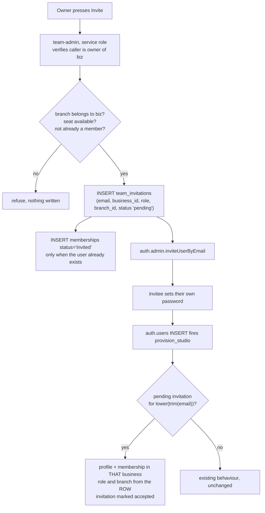
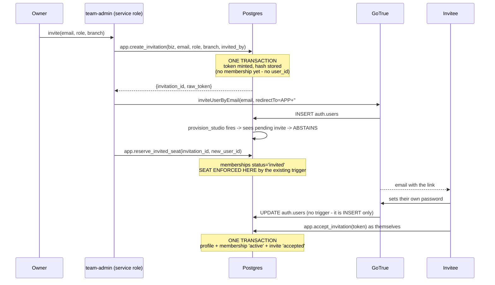

# Phase 1B — team invitations and memberships

**Design and audit only.** No migration written, no function changed, no
deployment, invitations still disabled. 25 September 2026.

Everything below was read from the live database and the shipped code. Where a
thing is proposed rather than observed it says so.

---

## The headline, before the detail

**Most of this is already built.** The schema was designed for invitations and
then never wired up. Specifically, and all verified in production today:

- `memberships.status` already has a `CHECK` allowing **`'invited'`**
- `app.enforce_seat_limit()` already counts `status in ('active','invited')`,
  so a pending invitation already occupies a seat
- `app.in_scope()` already requires `status = 'active'`, so an invited
  membership grants **no access at all** until it is accepted
- `memberships` already has `UNIQUE (business_id, user_id)`, so a duplicate
  membership is already impossible
- the composite FK `(branch_id, business_id) → branches(id, business_id)`
  already makes a cross-business branch unstorable

That is the entire security model for invitations, sitting unused. Phase 1B is
mostly *connecting* it, not designing it. The one genuinely new thing is a
trusted record saying which business an address was invited to.

---

## 1. CURRENT ACCOUNT CREATION MAP

`app.provision_studio()` is an **`AFTER INSERT` trigger on `auth.users`**
(`on_auth_user_created`, enabled). It therefore fires on **every** route that
creates an account — dashboard, API, signup form, invitation, all of them.
There is no route that avoids it.

**It is also the only thing in the entire system that writes `memberships`.**
Grepped across both Edge Functions, the customer app and the console: nothing
else touches that table.

| Route | Auth user created by | Profile by | Business? | Membership? | Role | Branch | Trigger |
|---|---|---|---|---|---|---|---|
| **Self-service studio signup** | GoTrue signup | trigger, step 2 | **yes, invented** from metadata | yes | `profiles.role_id='owner'`, `memberships.role='owner'` | null | `provision_studio` |
| **Operator prepares a studio** (`admin-api inviteStudio`) | `inviteUserByEmail` | trigger, step 1 | no — **claims** the row prepared with `pending_owner_email` | yes | owner / owner | null | `provision_studio` |
| **Operator invites a partner** (`invitePartner`) | `inviteUserByEmail` | none | no | **no** | n/a | n/a | `provision_studio` step 0, returns early |
| **Operator invites an operator** (`inviteOperator`) | `inviteUserByEmail` | trigger, step 2 — **invents a studio for them** | **yes, unwanted** | yes | owner / owner | null | `provision_studio`, then `admin-api` writes `platform_admins` |
| **`team-admin` invite** | would be `inviteUserByEmail` | trigger, step 2 first, then team-admin collides on the PK | **yes, invented** | yes, to the **wrong** business | owner / owner | null | `provision_studio` — **this is the bug** |
| **Password reset** | none | none | no | no | n/a | n/a | none |
| **Local PIN / demo login** | none — `layi_dash_users` in localStorage | none | no | no | app-level only | n/a | none |

### Two things this map turned up that were not in the brief

**`inviteOperator` has the same disease, quietly.** A Label Board staff member
invited through the console gets an auth user, the trigger sees no partner and
no prepared business, so it **invents a studio named after them** and makes them
its owner — and then `admin-api` writes their `platform_admins` row on top.
Production shows 9 businesses and 9 owner profiles, one of which
(`layiwolaojomo@thelabelboard.com`, your console login) is a platform admin who
also holds a studio. It is not a security hole, because the studio is empty and
theirs. It is junk data with the same root cause, and Phase 1B's fix removes it
too if we let it.

**`profiles.role_id` has no `CHECK` constraint.** It is free text defaulting to
`'owner'`. `memberships.role` has a strict four-value check. This matters in §7.

---

## 2. ROOT CAUSE

One sentence: **`provision_studio()` has no concept of joining a business that
already exists.**

Its three paths are *claim a partner*, *claim a business waiting on your email
and become its owner*, or *invent a business and become its owner*. All three
end in ownership of something. There is no fourth path that says "attach this
person to that business, as a member, with this role."

So `team-admin` could not use the trigger, and instead wrote `profiles`
directly — a table that no RLS policy consults. The result is the second,
deeper failure: even if the primary-key collision were fixed, the teammate
would hold a profile and `app.in_scope()` would return **false** for them. They
could sign in and see nothing.

Production confirms this has never worked: **0 non-owner profiles, 0 non-owner
memberships.**

---

## 3. PROPOSED ARCHITECTURE

The trusted fact must live in the database, written by the server, before the
account exists. This is not a new idea here — it is exactly the mechanism
`admin-api` already uses with `businesses.pending_owner_email`, and the reason
that mechanism is safe is that **the invitee does not control their own email
address in our database**. An attacker can put anything in
`raw_user_meta_data`; they cannot make us write a row saying they were invited.



**The client never names the business.** `team-admin` derives `business_id`
from the caller's own profile, as it already does. The trigger reads the
invitation row, never `raw_user_meta_data`.

---

## 4. PROPOSED SCHEMA

```
public.team_invitations
  id            uuid primary key default gen_random_uuid()
  business_id   uuid not null references businesses(id) on delete cascade
  email         text not null            -- stored already normalised
  role          text not null default 'staff'
                  check (role in ('manager','staff','viewer'))
  branch_id     uuid null
  invited_by    uuid not null            -- auth user id of the owner
  status        text not null default 'pending'
                  check (status in ('pending','accepted','cancelled'))
  created_at    timestamptz not null default now()
  expires_at    timestamptz not null default now() + interval '14 days'
  accepted_at   timestamptz null
  accepted_by   uuid null                -- the auth user that consumed it

  -- a branch, if given, must belong to the SAME business. Same composite
  -- key the rest of the schema already uses.
  foreign key (branch_id, business_id) references branches(id, business_id)
    on delete restrict

  -- at most ONE live invitation per address per business
  -- (partial unique index, not a constraint, so accepted/cancelled rows stay)
  unique index team_invitations_one_live
    on team_invitations (business_id, email) where status = 'pending'

  -- the lookup the trigger performs, on every single signup
  index team_invitations_pending_email
    on team_invitations (email) where status = 'pending'
```

**`role` deliberately excludes `'owner'`.** An invitation cannot mint a second
owner. Ownership transfer is a different act with different consequences and
should not ride in on this.

**No `'expired'` status.** Expiry is `expires_at < now()`, computed, not stored.
A stored expired state needs a job to write it and can be wrong between runs.
Three states, not four, and §10 sets out why.

**`email` is stored normalised** — `lower(btrim(email))` applied on the way in
by the Edge Function *and* enforced by a `CHECK (email = lower(btrim(email)))`
so a future writer cannot bypass it. The trigger then matches on a plain
equality, which uses the index.

---

## 5. PROVISION_STUDIO DECISION TREE

The safest ordering, and the reasoning for it:

```
0.  partner prepared for this address?           -> claim it, carry on
1.  TEAM INVITATION pending and unexpired?       -> join that business, RETURN
2.  business prepared (pending_owner_email)?     -> claim it as owner
3.  otherwise                                    -> invent a studio (unchanged)
```

**Why the team invitation goes above the prepared-business check.** They cannot
both legitimately apply — one says "own this new studio", the other says "join
that existing one" — but if they ever did, joining is the *lesser* grant.
Getting it wrong in that direction gives somebody less than intended, which is
recoverable. The reverse hands someone ownership of a studio, which is not.

**Why it stays below the partner claim.** The partner claim is `return new` on
the partner-only path and is already proved by `onboarding_harness`. Reordering
it re-opens a question that is already settled and tested. Leave settled things
settled.

**How ambiguity is prevented, concretely.** The partial unique index makes more
than one pending invitation per `(business_id, email)` impossible. Across
*different* businesses, several pending invitations for one address are legal
and expected — see §4 of your brief. The trigger therefore has to choose, and
the rule should be **oldest first** (`order by created_at limit 1`), with the
others left pending for the user to accept later from inside the app. Taking
the newest would let a second inviter silently displace the first.

**Step 1 must `return new` early**, before the profile and membership block
below it, because it writes its own profile and membership with the *invited*
role rather than `'owner'`. This is the same shape as the existing partner-only
early return.

---

## 6. INVITE ACCEPTANCE LIFECYCLE

**Who creates the membership: the trigger, and only the trigger.** It is
already the sole writer of that table, it runs as `SECURITY DEFINER` with a
pinned `search_path`, and it runs *inside the same transaction as the
`auth.users` insert*. That last point is what makes this safe, and it answers
most of §13.

**When: at account creation**, atomically with it.

**Duplicates:** impossible. `UNIQUE (business_id, user_id)` already exists. The
trigger should still use `on conflict (business_id, user_id) do update set
role = excluded.role, status = 'active'` so that re-acceptance is idempotent
rather than an error.

**Partial failure:** there is no partial. An `AFTER INSERT` trigger on
`auth.users` is in the insert's transaction. If the membership write raises,
the whole insert rolls back and **no auth user is created**. That is the
correct outcome: the invitation stays pending and the person can try again.

**One thing that must change for this to be true.** `provision_studio()` is
currently wrapped in `exception when others then raise warning; return new`.
That catch-all is what made an earlier bug silent, and with it in place a failed
membership write would leave an account with no studio and a warning nobody
reads. **For the invited path specifically, exceptions must propagate.** The
recommendation is to narrow the handler so the invitation branch is outside it,
rather than removing it wholesale and changing behaviour for the other paths.

---

## 7. ROLE AND PERMISSION MODEL

Two models exist and I am not adding a third.

| | `memberships.role` | `profiles.role_id` |
|---|---|---|
| Constraint | `CHECK in ('owner','manager','staff','viewer')` | **none — free text** |
| Default | `'staff'` | `'owner'` |
| Read by | `app.in_scope`, `app.is_business_admin` — **the RLS model** | the app, for its own permission screen |
| Security-bearing | **yes** | no |

**Phase 1B writes both, from one choice.** The owner picks an app role (the
things in `layi_dash_roles`: Creative, Manager, Sales, and so on). That value
goes to `profiles.role_id` unchanged. It is then **mapped** to one of the four
`memberships.role` values, and the map lives in the database next to the
trigger, not in the browser.

Conservative map, deliberately: anything not explicitly recognised becomes
`'staff'`. Never `'owner'`, never `'manager'`, because `is_business_admin`
grants branch and membership administration to `manager`.

**Later cleanup, not now:** `profiles.role_id` should get a `CHECK`, or the two
should be collapsed. Audit finding B3 covers the larger problem. Phase 1B's
obligation is only to not make it worse, and writing both from one mapped
source does not.

---

## 8. BRANCH ASSIGNMENT

**Proof that a branch belongs to the business is already structural.** The
composite FK on `team_invitations` and the identical one already on
`memberships` mean a cross-business `branch_id` cannot be stored. Not "is
rejected by a check" — cannot be stored. Postgres refuses the row.

That is the answer to test C, and it needs no application logic. `team-admin`
should *also* validate it so the owner gets a sensible message rather than a
constraint error, but the validation is a courtesy and the FK is the guarantee.

**Null means all branches**, and that is already the established meaning.
`app.in_scope` reads:

```sql
and (m.branch_id is null or p_branch is null or m.branch_id = p_branch)
```

A membership with a null branch matches every branch. So null is
*unrestricted*, not *unassigned*. The invite UI must say so in those words,
because "leave blank" reading as "no access" would be the natural guess and is
the opposite of the truth.

---

## 9. SEAT LIMITS

The mechanism exists and already contemplates invitations.

**Do pending invites count? Yes — once the membership row exists.**
`enforce_seat_limit` counts `status in ('active','invited')`. So the design
should write the `'invited'` membership **at invite time** where it can, which
makes the seat reservation real and visible.

**The catch, and it is the one genuinely awkward part of this design.** A
membership needs a `user_id`, and for a brand-new invitee no auth user exists
yet. So:

- **Invitee already has an account** → write `memberships` with
  `status='invited'` immediately. Seat reserved at invite time. The trigger
  is not involved at all (§14).
- **Invitee is new** → no membership can exist until they accept. The seat is
  reserved only by the `team_invitations` row, which `enforce_seat_limit` does
  not see.

**So: Basic with 4 of 5 seats used sends 3 invitations to new addresses.** All
three invitations are created. The first acceptance succeeds and takes seat 5.
The second and third **fail at the database** when the trigger tries to insert
the membership — and because the trigger is in the signup transaction, their
signups roll back entirely. They get an error, not a broken account.

That is safe but it is a poor experience: two people follow an email and are
told no. **Recommended additional guard:** `team-admin` refuses to *create* an
invitation when `active + invited memberships + pending invitations >= max_seats`.
Application-level, advisory, and it turns a bad experience into a clear message
at the moment the owner presses the button. **The database stays the final
word.** This is a courtesy check, exactly like the branch validation.

**Two simultaneous acceptances — and a real flaw to state plainly.**
`enforce_seat_limit` does `select count(*)` then compares. That is
check-then-act. Two transactions committing at the same instant can both see
`4 < 5` and both insert, leaving 6 seats on a 5-seat plan.

The window is milliseconds and needs two people clicking their invitation
links simultaneously, so it is unlikely rather than impossible. The fix is a
lock on the business row inside the trigger:

```sql
perform 1 from public.businesses where id = new.business_id for update;
```

taken before the count. This serialises seat checks per business and costs
nothing in the normal case. **This is a pre-existing flaw in shipped code, not
something Phase 1B introduces** — but Phase 1B is the first feature that makes
concurrent membership creation realistic, so it should be fixed here.

**Downgrade while invites are pending.** Nothing revokes on downgrade today;
the limit only bites on the next insert. So a business downgrading from Pro to
Basic with 8 members keeps all 8 and simply cannot add a ninth. Pending
invitations then fail on acceptance. **That is a product decision, not a
technical one, and it is question 1 in the readiness section.**

---

## 10. INVITATION STATES

Three, and only three:

```
pending ──accept──▶ accepted   (terminal)
   │
   └────cancel────▶ cancelled  (terminal)

expired = pending AND expires_at < now()   -- computed, never stored
```

**Allowed transitions:** `pending → accepted`, `pending → cancelled`. Nothing
else. Both terminal states are final: an accepted invitation is never reusable,
which is test F, and the partial unique index only covers `pending` rows so a
cancelled one does not block a fresh invitation to the same address.

**Why no stored `expired`.** It would need a scheduled job to write it, there
is no scheduler here, and between runs the stored state would be wrong. A
computed expiry is always right. Storing it also creates a fourth transition
with no behavioural difference from the third.

**Enforcement:** the trigger's lookup filters `status = 'pending' and
expires_at > now()`, so an expired invitation is simply not found, and the
signup falls through to the normal path. §11 says why that fall-through needs
thinking about.

---

## 11. EXPIRY

**14 days.** Long enough to survive a holiday, short enough that a forgotten
invitation to a staff member who was never hired does not sit live for months.

Supabase's own invite link expiry is separate and shorter — typically 24 hours,
set in Auth config. **So the two will routinely disagree**, and the common case
is the *link* dying while our invitation is still pending. That is fine and is
what Resend is for: the invitation row is untouched and a new link is sent
against it.

**The case that needs care is the other way round.** If our invitation expires
first and the person then follows a still-valid link, the trigger finds no
pending invitation and **falls through to step 3 — it invents them a studio.**
They become the owner of an empty business named after them, which is precisely
the failure Phase 1A disabled invitations to prevent.

**Recommendation:** make our expiry (14 days) comfortably longer than the Auth
link expiry (24 hours), so the link always dies first. And consider a step 2.5
in the trigger: if an *expired or cancelled* invitation exists for this address
and nothing else matches, **refuse rather than invent**. That converts a silent
wrong outcome into an error the person can report.

**Owner changes role before acceptance:** update the `team_invitations` row.
The trigger reads it at acceptance time, so the latest value wins with no
re-send needed.

---

## 12. RESEND AND CANCEL

| Action | What happens |
|---|---|
| **Resend** | Same invitation row, `expires_at` pushed out, new Auth link generated. **No new row, no new auth user.** The partial unique index makes a duplicate impossible even if the UI double-fires. |
| **Cancel** | `status = 'cancelled'`. If an `'invited'` membership was created (existing-user case), delete it, which releases the seat. |
| **Change role** | Update the row. No email needed. |
| **Change branch** | Update the row. The composite FK re-validates on update. |

Duplicate auth accounts are prevented by Supabase itself — `inviteUserByEmail`
errors on an address that already exists, which is why §14 exists as a separate
path.

---

## 13. FAILURE AND ROLLBACK

**The transaction does most of the work for us**, and this is the strongest
argument for putting the join logic in the trigger rather than in the Edge
Function.

| Failure | Outcome |
|---|---|
| Membership insert fails during acceptance | Whole `auth.users` insert rolls back. **No auth user, no profile, no orphan.** Invitation stays pending. |
| Profile insert fails | Same. |
| Seat limit hit at acceptance | Same — clean refusal. |
| Invitation status update fails | Same transaction, same rollback. |
| Network drops after the email is sent, before acceptance | Invitation sits pending until it expires. Nothing else exists. Harmless. |
| Network drops between creating the invitation row and calling `inviteUserByEmail` | **Invitation row with no email sent.** The only genuine orphan in the design, and it is benign: it shows in the pending list and Resend fixes it. |

**Orphan risk by type:**

- orphan auth users — **impossible**, transaction
- orphan businesses — **impossible**, the invited path never creates one
- orphan profiles — **impossible**, transaction
- orphan memberships — **impossible**, transaction; and cancellation deletes
  the `'invited'` row
- orphan invitations — possible, benign, self-healing via Resend or expiry

---

## 14. EXISTING USER INVITATION

This needs its own path because **the trigger cannot help** — it only fires on
account creation, and the account already exists.

```
team-admin, invite, address already has an auth account:
  1. resolve the auth user id by email (service role)
  2. REFUSE if they are a platform admin        -- see below
  3. REFUSE if already a member of this business
  4. INSERT memberships (business_id, user_id, role, branch_id,
                         status = 'invited')     -- seat reserved now
  5. INSERT team_invitations ... status 'pending'
  6. notify them — NOT inviteUserByEmail, which would error
  7. they accept in-app; the membership flips 'invited' -> 'active'
```

Acceptance for an existing user is therefore an **app action, not a signup**,
and needs its own small RPC — `app.accept_invitation(invitation_id)` — running
as `SECURITY DEFINER`, checking `auth.uid()`'s email against the invitation's,
and flipping both rows in one transaction.

**Their existing memberships are untouched.** That is test D, and it works
because `memberships` is keyed `(business_id, user_id)`: a second row is a
second membership, not a conflict.

**Platform admins.** A studio owner must not be able to attach a Label Board
staff account to their studio, because `platform_admins` is how `admin-api`
decides who may act on every tenant. `team-admin` already refuses a platform
admin as a *target* via `verifyTarget`; the invite path needs the same check
against the resolved user id. **Refuse, with the same neutral message.**

The edge case worth naming: an account that is *both* a platform admin and a
studio user already exists in production today —
`layiwolaojomo@thelabelboard.com` holds a `platform_admins` row and an owner
profile, because `inviteOperator` invented a studio for it. The refusal above
is the right call anyway: that combination should arise from operator tooling,
never from a tenant's invite box.

---

## 15. REQUIRED AUTOMATED TESTS

All runnable in PGlite against the real migrations, in the existing harness
style. **Every one of these should be written before the migration.**

| ID | Test | Expected |
|---|---|---|
| A | New user invited to Business A | no new business; profile in A; membership in A; role as mapped; branch as set; seats +1 |
| B | Client submits `business_id = B` | ignored — business comes from the caller's profile |
| C | Branch belonging to B | **FK refuses the row** |
| D | Existing owner of B invited to A | same auth user; no new business; new membership in A; B's membership unchanged |
| E | Seat limit reached at acceptance | membership refused; **whole signup rolls back** |
| F | Accepted invitation reused | refused — status is terminal |
| G | Expired invitation | not found; falls through (see §11 for what that must mean) |
| H | Cancelled invitation | not found; refused |
| I | Two simultaneous acceptances | exactly one membership — **fails today without the row lock, which is the point of writing it** |
| J | Normal signup, no invitation | existing studio provisioning unchanged |
| K | Business count before and after every invite | unchanged |
| L | Platform admin address invited | refused |
| M | Invitation cannot set `role='owner'` | CHECK refuses |
| N | Two pending invitations, same address, same business | partial unique index refuses the second |
| O | Two pending invitations, same address, different businesses | both allowed; oldest consumed first |
| P | `in_scope` for an `'invited'` membership | **false** — a reserved seat grants nothing |

P and I are the two I would write first. P because it is the security promise
in one line, and I because it is expected to fail against today's code.

---

## 16. MIGRATION PLAN

Four things, in this order, each with its own migration file:

1. **`team_invitations`** — table, both indexes, all constraints, RLS enabled
   and forced, no policies at all, grants only to `service_role`.
2. **The row lock in `enforce_seat_limit`** — one `perform ... for update`
   line. Separate file because it fixes a pre-existing race and should be
   revertable on its own.
3. **`provision_studio`** — step 1 inserted, narrowed exception handling.
   **Copy the current body from the last migration that defines it and diff
   before applying.** It has been redefined five times; copying the wrong
   generation silently undid two features on 21 September and `billing_harness`
   caught it in under a minute.
4. **`app.accept_invitation()`** — the existing-user RPC, `SECURITY DEFINER`,
   `search_path` pinned, execute granted to `authenticated` only.

**Rollback.** 3 is the risky one and it is a `create or replace` — reverting
means re-applying the previous body, which is why it must be copied rather than
retyped. 1, 2 and 4 are additive and revert cleanly. Nothing drops a column or
changes an existing row's meaning, so there is no data migration and no
one-way door.

---

## 17. RLS FOR INVITATIONS

**Enabled, forced, and zero policies.** Same as `platform_admins`,
`payment_methods` and five other tables already: RLS on with no policy is
deny-all to every non-superuser role, and the only reader is the service role
inside the Edge Function.

Owners do not query `team_invitations` directly. They call `team-admin list`,
which is already owner-gated and already scopes to the caller's business.

**Revoke `authenticated` and `anon` grants explicitly.** Supabase's default
privileges hand new tables to those roles automatically; RLS masks it today but
the audit already flagged the same latent hazard on `platform_admins`. Two
tables with that shape is a pattern; three is a habit.

**Enumeration:** impossible for an unauthenticated caller — no grant, no
policy, and the table is never exposed through PostgREST in any code path.

---

## 18. PRIVACY

A pending invitation holds somebody's email address before they have agreed to
anything, which makes it the most sensitive small table in the schema.

- **Retention:** delete `accepted` and `cancelled` rows **90 days** after they
  reach that state. There is no scheduler, so this is a line in the existing
  `admin-api` housekeeping or a manual query until there is one. Say which in
  the runbook rather than assuming.
- **Who can view:** the owner of that business, through `team-admin list`, and
  Label Board staff through `admin-api` if we choose to expose it. Nobody else.
- **Audit logs:** `platform_audit` records the *action* and the business, not
  the payload, so an address does not land there today. Keep it that way — do
  not add the email to the log detail.
- **What is deleted on business deletion:** `on delete cascade` from
  `businesses` takes the invitations with it.

---

## 19. UI, MINIMUM

Backend first; this is the smallest surface that makes it usable.

**Team screen**, replacing the "temporarily unavailable" panel:

```
Team accounts                                    [+ Invite]

ACTIVE
  Idara Umah          Manager · Lagos studio         Edit
  Tunde Bakare        Creative · all branches        Edit

PENDING
  seyi@example.com    Creative · invited 2 days ago
                                        Resend  Cancel
```

**Invite modal:** email, name, role, branch. Branch defaults to **All
branches**, labelled in those words rather than left blank, per §8. One button:
Send invitation.

Nothing else. No bulk invite, no CSV, no custom message.

---

## 20. RISKS

| Risk | Severity | Mitigation |
|---|---|---|
| Editing `provision_studio` again | **HIGH** | Copy from the last defining migration, diff mechanically, run all 15 harnesses. It has bitten twice this month. |
| The catch-all exception handler swallowing a failed join | **HIGH** | Narrow it so the invited path propagates. Test E proves it. |
| Expired invitation falling through to "invent a studio" | **MEDIUM** | §11: expiry longer than the link's, and consider refusing on a known-expired address. |
| Seat race | **MEDIUM** | Row lock, and test I written to fail first. |
| SMTP not configured | **MEDIUM** | Nothing arrives and the owner cannot tell why. **Verify before enabling.** |
| Redirect URL not allowlisted | **MEDIUM** | The link lands on the wrong site. `admin-api` preflights this; reuse that. |
| Role mapping too generous | **LOW** | Default to `'staff'`; never map to `'owner'`. |

---

## 21. WHAT NOT TO CHANGE

- **`app.in_scope` and `app.is_business_admin`.** Correct as they stand. The
  `status = 'active'` check is what makes `'invited'` safe.
- **The `memberships` constraints.** Unique key, role check, status check,
  composite branch FK. All four are load-bearing and all four already do
  exactly what Phase 1B needs.
- **The partner claim at step 0** of `provision_studio`, and its early return.
- **Forced RLS everywhere**, the storage design, the plan-limit triggers.
- **`admin-api`'s shape** — JWT verified, `platform_admins` checked, per-role
  allowlist, every call logged.
- **The Phase 1A guard.** `verifyTarget` and the branded type stay exactly as
  deployed.

---

## 22. RECOMMENDED SEQUENCE

1. **Write the tests first** — all 16 in §15, against today's code. A, D, I, P
   will fail. That is the specification.
2. **Migration 1**, the table. Additive, no behaviour change. Tests N and O go
   green.
3. **Migration 2**, the seat race lock. Test I goes green.
4. **Migration 3**, `provision_studio`. The dangerous one, alone, with the full
   suite either side. Tests A, E, G, J, K, P go green.
5. **Migration 4**, `accept_invitation`. Test D goes green.
6. **`team-admin`**: real `invite`, plus `resend`, `cancel`, and the existing-user
   branch. Switch still off.
7. **Verify SMTP and the redirect allowlist** on staging or production.
8. **Flip both switches**, deploy, run the runtime checks the way Phase 1A did.

Steps 1 to 6 are all reversible and none of them changes behaviour for anybody
until step 8.

---

---
---

# PART TWO — the architecture question, answered

**25 September 2026. This part supersedes §5, §6, §9, §11 and §14 above where
they disagree. It was written after checking one assumption in the live data
and finding it wrong.**

## The correction that changes everything

Part One said the trigger fires when an invited person **accepts**. That is
false, and your own database proves it. `r2wapparels@gmail.com` is the one
genuine invitation this project has ever sent:

```
created_at    2026-09-15 14:29:27.527      <- auth.users row exists HERE
invited_at    2026-09-15 14:29:27.599      <- 72 ms later
confirmed_at  2026-09-15 14:29:56.664      <- 29 SECONDS later, they accepted
```

**`inviteUserByEmail` creates the `auth.users` row at INVITE time**, inside our
own Edge Function call, while the service role is in control. Acceptance is an
`UPDATE` — it sets `confirmed_at` and the password — and
`on_auth_user_created` is an `AFTER INSERT` trigger, so **acceptance does not
fire it at all.**

Three consequences, all good:

1. The trigger never has to choose between competing invitations, because it
   runs before anybody has chosen anything. Case B's ambiguity does not reach
   it.
2. The trigger's entire job for an invited address shrinks to one boolean:
   **abstain**. Do not invent a studio. Nothing else.
3. **A `user_id` exists at invite time**, for new and existing invitees alike.
   So the `memberships` row with `status = 'invited'` can be written
   immediately in both cases, and the seat is reserved by the existing database
   trigger at the moment the owner presses the button.

That last point collapses Case A and Case B into **one acceptance path**. There
is no "new user flow" and "existing user flow". There is one flow with one
difference at the start: whether we call `inviteUserByEmail` or resolve an
existing id.

---

## The token

**The invitation's identity is a token, not an email address.** Email alone is
ambiguous, as you said, and I am not using "first pending" as a tiebreak.

**What is generated:** 32 random bytes from `gen_random_bytes(32)`,
base64url-encoded. 256 bits. Generated **in the database**, inside the
`SECURITY DEFINER` function that creates the invitation, so it never passes
through application memory on the way in.

**What goes in the link:** the raw token, in the URL fragment.

```
https://app.thelabelboard.com/#invite=<raw token>
```

The fragment matters. Everything after `#` is **never sent to any server** —
not in the request line, not in `Referer`, not into a Netlify or Supabase
access log. The app reads it with `location.hash` and it stays on the device.

**What is stored:** only `token_hash`, `encode(digest(token,'sha256'),'hex')`.
The raw token is returned exactly once, to the Edge Function that builds the
email, and is never stored anywhere. **A database dump does not yield a single
usable invitation link.** This is the same reason we store password hashes.

**How it is validated:** `accept_invitation(p_token)` hashes the presented
token and looks the row up by `token_hash`, which is unique and indexed. Then,
and all of these together:

- the row's `status` is `'pending'`
- `expires_at > now()`
- `lower(btrim(invitation.email))` equals the **caller's own verified email**,
  read from `auth.users` by `auth.uid()` — never from the request
- the caller's `email_confirmed_at` is not null

The token says *which invitation*. The session says *who you are*. **Both must
agree.** A stolen token is useless without the mailbox, and a session is
useless without the token.

**How it is consumed once, and why replay is impossible.** Consumption is a
conditional update, not a read followed by a write:

```sql
update public.team_invitations
   set status = 'accepted', accepted_at = now(), accepted_by = v_uid
 where id = v_invite.id
   and status = 'pending'          -- the guard IS the concurrency control
returning id into v_claimed;

if v_claimed is null then
  raise exception 'That invitation has already been used.'
    using errcode = '23505';
end if;
```

Two simultaneous submissions of the same token both reach the `update`; Postgres
serialises them on the row lock; the first commits with `status = 'accepted'`,
the second's `where status = 'pending'` no longer matches and it updates zero
rows and raises. **One membership, always, with no advisory lock and no retry
loop.** That is test I.

---

## 1. NEW-USER ACCEPTANCE PATH



**The order is deliberate.** The invitation row is written **before**
`inviteUserByEmail`, so that when the trigger fires mid-INSERT it can already
see a pending invitation for that address and abstain. Reverse the order and
the trigger invents a studio, which is the exact bug Phase 1A disabled.

**If `reserve_invited_seat` fails** — seat limit, anything — `team-admin`
deletes the auth user it just created and cancels the invitation. That is one
compensating action, it cannot orphan a business because none was made, and it
leaves the system exactly as it was.

## 2. EXISTING-USER ACCEPTANCE PATH — Case A

User owns Business B. Business A invites the same address.

```
team-admin invite, address already has an auth account:
  1. resolve the auth user id by email, service role
  2. REFUSE if they hold a platform_admins row
  3. REFUSE if already a member of Business A          (unique key would anyway)
  4. app.create_invitation(...)        -> token
  5. app.reserve_invited_seat(id, uid) -> memberships status='invited'
                                          SEAT ENFORCED HERE
  6. send the link ourselves. NOT inviteUserByEmail, which errors on an
     existing address. Same template, our own send.
  7. they sign in as themselves and call app.accept_invitation(token)
```

**Steps 4 and 5 are one transaction.** Steps 1–3 are reads.

Note what is identical to the new-user path: 4, 5, 7. The only differences are
*resolve instead of create* and *our email instead of GoTrue's*. Acceptance is
byte-for-byte the same function.

Against your checklist:

| Requirement | How |
|---|---|
| identifies the authenticated existing user | `auth.uid()` inside `SECURITY DEFINER`; never from the request |
| proves verified email matches | compares the invitation's email to `auth.users.email` for that uid, and requires `email_confirmed_at is not null` |
| creates the Business A membership | `reserve_invited_seat` at invite, flipped to `'active'` at acceptance |
| applies role and branch | from the invitation **row**, never the request |
| enforces the seat limit | `enforce_seat_limit` fires on the `'invited'` insert, at invite time |
| consumes the invitation | conditional update, `where status='pending'` |
| transactionally | one function, one transaction, both rows |
| no second auth user | `inviteUserByEmail` is never called for an existing address |
| no second business | the invited path never touches `businesses` |
| Business B unchanged | `memberships` is keyed `(business_id, user_id)`; a second row is a second membership |

## 3. MULTIPLE-INVITE DISAMBIGUATION — Case B

A and B both invite `person@example.com`. Both invitations pend. Two distinct
tokens, two distinct rows, two distinct links in the mailbox.

**The person chooses by clicking a link.** That is the disambiguation, and it
is the only one that carries intent. Nothing guesses.

- **Neither the browser nor the metadata names the business.** The token names
  the invitation; the invitation names the business; the invitation was written
  by our server. The browser holds a bearer token, which is a *pointer*, not an
  *authority* — and the thing it points at is trusted state.
- **`raw_user_meta_data` is not used at all**, for anything, on this path.
- **"First pending for this email" appears nowhere.**
- Accepting A's link leaves B's pending. They can accept it later from inside
  the app, which is the correct outcome for someone genuinely working for two
  studios.
- Whichever arrives first creates the auth user; the second sees an existing
  address and takes the Case A path. Both work.

## 4. PLATFORM OPERATOR PATH

`platform_admins` is keyed by auth user id and has no pending-email column, so
`admin-api` cannot write the row before the account exists — which is exactly
why the trigger invents a studio for every operator it invites.

**Fix, same pattern as `partners.pending_email`:** add
`platform_admins.pending_email`, with a partial unique index on
`lower(pending_email)`. `admin-api` writes that row **before**
`inviteUserByEmail`, exactly as it already does for studios and partners. The
trigger gains a step 0 that claims it and returns.

| Requirement | How |
|---|---|
| no invented tenant business | trigger abstains and returns before step 3 |
| no tenant membership unless intended | the operator branch writes none |
| platform access keeps working | the `platform_admins` row is claimed, `active` unchanged |
| existing junk studio | **left alone.** No migration touches it. Cleaned separately after verification, as you asked |

## 5. SEAT-LIMIT BEHAVIOUR

Your decision 1, implemented:

- existing active members are **never** deactivated by anything in Phase 1B
- **no new invitation** while at or over the limit — `create_invitation` counts
  `active + invited` memberships plus pending invitations and refuses
- **no activation** while over — `accept_invitation` re-checks, and
  `enforce_seat_limit` is the backstop
- **no reactivation** while over — `suspended → active` is an UPDATE, and
  `enforce_seat_limit` already handles that case: it exempts a row whose *old*
  status was already seat-occupying, so a genuine reactivation is checked
- **the database is the final layer** — every application check above is a
  courtesy that produces a better message

**The seat is reserved at invite time in both cases**, because a `user_id`
exists in both. `enforce_seat_limit` already counts `'invited'`. Nothing new is
needed for the counting itself.

**Basic, 4 of 5 used, three invitations:** the first is created and takes seat
5. The second and third are **refused at creation** with "no seats left" — the
owner finds out immediately, rather than two people following a link into an
error.

**The race still needs the row lock** from §9 of Part One. `enforce_seat_limit`
does `select count(*)` then compares, and two `reserve_invited_seat` calls can
interleave. `perform 1 from businesses where id = new.business_id for update;`
before the count. Pre-existing flaw; this phase makes it reachable.

**Downgrade** is out of scope per your decision, and belongs in a separate
document on billing and grace periods. Recorded, not solved.

## 6. TRANSACTION BOUNDARIES

| Step | Boundary | If it fails |
|---|---|---|
| `create_invitation` | one transaction | nothing written |
| `inviteUserByEmail` | GoTrue's own; the trigger runs inside its INSERT | no auth user, no invitation consumed |
| trigger abstain | inside that INSERT | if it raised, the whole INSERT rolls back — no orphan |
| `reserve_invited_seat` | one transaction | **compensate:** delete the auth user, cancel the invitation |
| `accept_invitation` | **one transaction:** profile + membership + invitation | all three roll back; invitation stays pending; they retry |

**One compensating action in the whole design**, and it is the only place two
systems have to agree. Everything else is a single transaction.

**The catch-all must be narrowed.** `provision_studio` is wrapped in
`exception when others then raise warning; return new`. With that in place, a
failure in the invited branch becomes a silent warning and the account is
created anyway. The abstain branch must sit **outside** the handler so it
propagates. The other paths keep it, so no existing behaviour changes.

## 7. ADDITIONAL TESTS

On top of A–P in §15, all runnable in PGlite:

| ID | Test | Expected |
|---|---|---|
| Q | Token is stored hashed | no column contains the raw token; `token_hash` is 64 hex chars |
| R | Guessed or altered token | not found; refused |
| S | Valid token, **wrong signed-in user** | refused — session email ≠ invitation email |
| T | Valid token, caller's email unconfirmed | refused |
| U | Same token submitted twice concurrently | one succeeds, one raises; **exactly one membership** |
| V | Token for a cancelled invitation | refused |
| W | Token for an expired invitation | refused, **and no business created** |
| X | Two pending invitations, same address, two businesses; accept A's token | membership in A only; B's still pending |
| Y | Then accept B's token | membership in B; A's untouched; two memberships, one auth user |
| Z | Trigger abstains when a pending invitation exists | no business, no profile, no membership at INSERT time |
| AA | Operator invite | `platform_admins` claimed; **no business**; no membership |
| AB | Operator invite leaves existing junk studios alone | business count for the old ones unchanged |
| AC | Invite refused at the seat ceiling | no invitation row, no auth user |
| AD | Reactivating suspended while over the limit | refused by `enforce_seat_limit` |
| AE | `create_invitation` cannot be called by a non-owner | refused |
| AF | Raw token never appears in `platform_audit` or any log column | absent |

**U, S and Z are the three I would write first.** U is the replay guarantee, S
is the stolen-token guarantee, Z is the "no invented studio" guarantee.

## Revised migration plan

1. `team_invitations` + `app.create_invitation` + `app.reserve_invited_seat` +
   `app.accept_invitation`. RLS forced, zero policies, `service_role` and
   `authenticated` execute only where needed.
2. Row lock in `enforce_seat_limit`.
3. `platform_admins.pending_email` + partial unique index.
4. `provision_studio` — the abstain branch, the operator claim, narrowed
   exception handling. **Copy from `20260921150000`, the current definition,
   and diff before applying.** Five generations exist; copying the wrong one
   silently undid two features on 21 September.
5. `admin-api` writes `pending_email` before inviting an operator.
6. `team-admin` real invite, resend, cancel, existing-user branch. Switch off.

Rollback: 1, 2, 3 are additive. 4 is `create or replace` and reverts by
re-applying the previous body, which is why it is copied rather than retyped.
No column is dropped, no existing row changes meaning.

---

---
---

# PART THREE — four corrections

**25 September 2026. Supersedes the token design and the transaction claims in
Part Two. Four points raised, four conceded.**

## 1. The secret token is gone

**The claim in Part Two was false.** `redirectTo` is an argument to
`inviteUserByEmail`, so the complete URL — token included — is sent from our
Edge Function to Supabase Auth over the wire, stored by GoTrue while the
invitation is live, and emitted in its logs. "Never reaches any server" was
wrong on its own page, two lines below the call that sends it.

And once that is admitted, the token earns nothing. Acceptance already requires
**all** of: a session, `auth.uid()` resolving to a real user, that user's email
confirmed, that email equalling the invitation's recipient, `status = 'pending'`,
and `expires_at > now()`. Possession of the identifier adds no capability to
someone who cannot satisfy those. A v4 UUID is 122 unguessable bits, so
enumeration is not a real attack either.

**Adopted: `team_invitations.id`, an opaque UUID, used as a SELECTOR.**

```
https://app.thelabelboard.com/#invite=<invitation uuid>
```

`app.accept_invitation(p_invitation_id uuid)` independently verifies every one
of the conditions above, reading the caller from `auth.uid()` and their email
from `auth.users` — never from the request. **Possession of the id alone grants
nothing.** No `token_hash` column, no second credential, no hashing ceremony.

Replay is still prevented the same way, and it is the conditional update doing
the work rather than the secrecy of the identifier:

```sql
update public.team_invitations
   set status = 'accepted', accepted_at = now(), accepted_by = v_uid
 where id = p_invitation_id
   and status = 'pending'
returning business_id, role, branch_id into v_row;

if not found then
  raise exception 'That invitation is no longer valid.';
end if;
```

## 2. Seats are held by the invitation, not by a membership

The two-RPC sequence was not one transaction and calling it one was wrong.

Rather than patch it, the cause is removed. **Phase 1B creates no `'invited'`
membership at all.** A pending invitation holds the seat by itself, and the
membership is created once, at acceptance.

That change does more than fix the boundary:

- **the existing-user path becomes one function and one transaction**, because
  there is no longer a second write that needs a `user_id`
- **the new-user path needs no compensating action**, because nothing is
  written after the GoTrue call
- both paths become the same two steps

`memberships.status = 'invited'` stays in the schema, unused by this phase, and
`enforce_seat_limit` keeps counting it harmlessly.

**The seat definition, used identically everywhere:**

```
seats(business) =
    memberships   where status in ('active','invited')
  + team_invitations where status = 'pending' and expires_at > now()
```

## 3. One lock, always taken first

Every operation that can consume a seat takes the **same single lock** before
counting:

```sql
perform 1 from public.businesses where id = p_business for update;
```

| Operation | Takes the lock | Then |
|---|---|---|
| `app.create_team_invitation` | yes, first statement | counts seats, inserts the invitation |
| `app.accept_invitation` | yes, first statement | counts seats, inserts the membership |
| `app.set_membership_status` (reactivation) | yes, first statement | counts, then updates |
| `app.enforce_seat_limit` (trigger) | yes | counts |

**Why this cannot deadlock.** A deadlock needs two or more lock objects
acquired in different orders. There is exactly one lock object here — the
`businesses` row — and it is always the first lock any of these paths takes. A
cycle is not constructible.

The trigger case is safe for a second reason: when `accept_invitation` inserts
a membership it already holds that row lock in the same transaction, and
Postgres row locks are re-entrant within a transaction, so the trigger's
`for update` returns immediately.

**Two owners on two devices racing for the last seat:** both call
`create_team_invitation`, both reach the `for update`, one waits. The first
counts 4 of 5, inserts, commits. The second then counts 5 of 5 and is refused.
One invitation, correct message, no race.

## 4. The discriminator — and one thing I cannot verify

**The objection is right and it is the most important of the four.** "A pending
invitation exists for this email" is not a discriminator. Jane, invited by
Business A and not yet accepted, who independently signs up to start her own
studio, would have had her legitimate signup silently abstain. She would land
in an app with no studio and no explanation.

**`invited_at` is the right idea, and I cannot confirm it is usable.** Your
production data shows it populated for the one real invitation and null for
every self-created account, so it discriminates correctly *after the fact*. But
the timestamps show `created_at 14:29:27.527` and `invited_at 14:29:27.599` —
**72 milliseconds apart**, which suggests GoTrue sets it in a follow-up
`UPDATE` rather than in the `INSERT`. If so it is **null at the moment an
`AFTER INSERT` trigger reads `new`**, and the discriminator never fires.

**CANNOT VERIFY** from here. It needs one insert against real GoTrue on
staging, which is test AG below.

**So the primary discriminator is one we own outright**, with `invited_at` as
corroboration if staging proves it populated:

```
team_invitations.auth_user_expected_at  timestamptz null
```

`team-admin` sets it to `now()` in the moments before calling
`inviteUserByEmail`, and clears it immediately after. The trigger abstains only
when it finds a pending, unexpired invitation for that address **whose
`auth_user_expected_at` is set and less than five minutes old**.

- Nobody outside the service role can write it. It is not metadata, not a
  header, not anything a browser can influence.
- It is true for at most a few seconds per invitation.
- Jane's self-signup sees it null and proceeds normally. Her invitation stays
  pending and she can accept it later from inside the app.
- A cancelled or expired invitation is not `pending`, so it is invisible to the
  trigger. Old invitation data cannot poison a future signup.
- The five-minute bound means a crashed `team-admin` between set and clear
  cannot leave an address permanently unable to self-register.

**The residual window is real and worth naming:** if Jane self-signs-up in the
same few seconds that Business A is inviting her, the trigger abstains and she
gets no studio. It fails toward granting less, it is recoverable in one
support action, and the alternative failure direction — handing her a studio
that then collides — is the bug we are fixing.

## 5. The two expiries are independent

Part Two said our 14 days "guarantees the link dies first". Withdrawn: GoTrue's
invite expiry is Auth configuration I have not read.

**They are independent and either may expire first.**

| Which expired | What the person sees | Resend does |
|---|---|---|
| Auth link only | link is dead, invitation still pending | issues a fresh link against the same invitation row |
| Our invitation only | link works, acceptance refused as expired | extends `expires_at`, reissues the link |
| Both | either symptom | extends and reissues |

**Resend is one action and does both halves unconditionally** — extend
`expires_at`, then reissue — so nobody has to work out which clock ran out.
Reissuing for an unconfirmed account uses `generateLink({type:'invite'})`
rather than `inviteUserByEmail`, which errors on an address that already
exists.

14 days stays as the recommendation. Not because it beats the other clock, but
because it is long enough to survive a holiday and short enough that an
invitation to somebody never hired does not sit live for months.

## Tests added by these corrections

| ID | Test | Expected |
|---|---|---|
| AG | **`invited_at` at INSERT time, against real GoTrue** | settles §4. **Staging only.** Until it runs, `auth_user_expected_at` is the sole discriminator |
| AH | Invitation id is an ordinary UUID, no secret stored | no `token_hash` column anywhere |
| AI | Knowing an invitation id, signed in as the **wrong** user | refused |
| AJ | Knowing an invitation id, **not signed in** | refused |
| AK | Correct user, email **not** confirmed | refused |
| AL | `create_team_invitation` for an existing user, seat check fails | **neither invitation nor membership exists** |
| AM | Two devices race the last seat | exactly one invitation created |
| AN | Two acceptances race the last seat | exactly one membership |
| AO | **Jane's case**: pending invitation, she self-signs-up | **studio created normally**; invitation still pending |
| AP | Jane then accepts the invitation | second membership; her own studio untouched |
| AQ | Cancelled invitation, then self-signup | normal signup |
| AR | Expired invitation, then self-signup | normal signup |
| AS | `auth_user_expected_at` set but stale (> 5 min) | treated as unset; normal signup |
| AT | Reactivate suspended member while at the ceiling | refused |
| AU | Resend after our expiry | `expires_at` extended, new link, same invitation row |
| AV | Resend after the Auth link expiry | new link, same invitation row |

**AO is the one to write first.** It is the bug this correction exists to
prevent, and it fails against the Part Two design.

## Final migration order

1. `team_invitations` — table, indexes, constraints, RLS forced with zero
   policies, `auth_user_expected_at`, **no token column**.
2. `app.seats_used(business)` and the shared `for update` lock helper.
3. Row lock added to `enforce_seat_limit`.
4. `app.create_team_invitation` — one transaction, lock then count then insert.
5. `app.accept_invitation` — one transaction, lock, count, profile, membership,
   conditional consume.
6. `platform_admins.pending_email` + partial unique index.
7. `provision_studio` — abstain branch keyed on `auth_user_expected_at`,
   operator claim, narrowed exception handling. **Copy from `20260921150000`
   and diff before applying.**
8. `admin-api` writes `pending_email` before inviting an operator.
9. `team-admin` — invite, resend, cancel, existing-user branch. Switch off.

1 to 6 are additive and revert cleanly. 7 is `create or replace` and reverts by
re-applying the previous body.

---

---
---

# PART FOUR — the nonce discriminator

**25 September 2026. Replaces `auth_user_expected_at` from Part Three.**

## Adopted, and the reason is the failure mode

The nonce eliminates the self-signup race outright, and it does so without
trusting metadata for anything that matters. `business_id`, `role`, `branch_id`
and every authorization decision still come from the `team_invitations` row.
The metadata carries a **provenance signal and nothing else**: *this particular
INSERT is the one our invite caused.*

The strongest argument for it is not that it is elegant. It is that **it fails
closed.**

| | if the mechanism misfires |
|---|---|
| `auth_user_expected_at` | a legitimate self-signup inside the window is abstained — **the user silently gets no studio** |
| **nonce** | the trigger does not abstain, `team-admin`'s profile insert collides on the primary key, the invite **fails loudly** and nothing is created |

A loud failure at invite time is a support ticket. A silent one at signup time
is Jane wondering why the product is empty. That asymmetry decides it.

## What I can and cannot prove about metadata

**I tried to prove it from production and the evidence does not hold.** Every
business whose name differs from its owner's email prefix — Adé Bespoke, Ìfé
Leather, Seed Multi Studio — was created by `seed_test_studios.sql`, and LAYI
was created by `prepare_layi_studio` and claimed through `pending_owner_email`.
Not one of them came from the trigger's step 2. So they say nothing about
whether metadata was readable at INSERT.

**What I do rely on:** reading `new.raw_user_meta_data` in an `AFTER INSERT`
trigger on `auth.users` is the canonical Supabase pattern — it is how the
documented `handle_new_user` function copies a signup's `full_name` into
`profiles`, and it is what `provision_studio` step 2 already does for
`business_name`, `name` and `referral_code`. The column is populated by the
same `INSERT` that fires the trigger.

**What I have NOT proved:** that `inviteUserByEmail(email, { data })` routes
`data` into `raw_user_meta_data` on that same `INSERT`. It is the same GoTrue
user-creation path and I expect it to, but expecting is not knowing, and I have
just been wrong once this week by assuming exactly this kind of thing about
GoTrue's timing.

**So the nonce is nonce-only, with no time-window fallback, gated on one
staging test.** Falling back to `auth_user_expected_at` "just in case" would
reintroduce the race we are removing. If staging shows the metadata is not
there, we choose again with real information rather than hedging now.

## Schema change

```
team_invitations
  ...
- auth_user_expected_at  timestamptz          -- REMOVED
+ nonce_hash             text null            -- sha256 hex of a one-time nonce
+ nonce_issued_at        timestamptz null
```

`app.create_team_invitation` mints the nonce with `gen_random_bytes(32)`
**inside the database**, stores only `encode(digest(nonce,'sha256'),'hex')`,
and returns the raw value exactly once. It is never stored, never logged, never
put in a URL, and never emailed.

`nonce_hash` is set to null once consumed, so the signal is single-use in the
row as well as by construction.

## The trigger's abstain condition

Abstain **only** when every one of these holds:

```
1. new.raw_user_meta_data ? 'team_invitation_id'     -- present
2. new.raw_user_meta_data ? 'team_invitation_nonce'  -- present
3. an invitation with that id exists
4. its nonce_hash is not null
5. encode(digest(presented_nonce,'sha256'),'hex') = nonce_hash
6. status = 'pending'
7. expires_at > now()
8. lower(btrim(new.email)) = invitation.email
```

Any failure → **fall through to normal signup, unchanged.** No exception, no
special case. A forged pair is indistinguishable from no pair at all.

On success the trigger clears `nonce_hash` and returns, writing nothing.

**Why 8 matters as much as 5.** Without the email check, anyone who learned a
valid pair could sign up under a different address and have the trigger abstain
for them. With it, the pair is bound to one address, and that address can only
be INSERTed once because `auth.users.email` is unique. The nonce is therefore
spent by the act of using it, before the row even lands.

## Metadata is cleared afterwards

`team-admin` calls `updateUserById(id, { user_metadata: {} })` immediately
after the invite returns. The invitee therefore never sees the pair in their
own session.

Between the invite and the clear — under a second — a hypothetical reader of
their own `user_metadata` would gain nothing: the INSERT their nonce
identifies has already happened, and no second INSERT for that email is
possible. **The name is deliberately not passed in metadata**, so clearing it
wholesale destroys nothing we need. The name lives on the invitation row.

## Seat conversion — order is the whole answer

`seats_used = memberships('active','invited') + invitations(pending, unexpired)`

At acceptance on a five-seat plan with 4 active and this pending invitation,
seats_used is already 5. Inserting the membership first would make it 6 and be
refused. **So the invitation is consumed before the membership is written**, in
one transaction, under one lock:

```
app.accept_invitation(p_invitation_id):
  1. perform 1 from businesses where id = v_biz for update;   -- the only lock
  2. update team_invitations set status='accepted', accepted_at=now(),
            accepted_by=v_uid, nonce_hash=null
      where id = p_invitation_id and status='pending'
     returning business_id, role, branch_id into v_row;       -- consume FIRST
     if not found then raise;
  3. -- the reservation is now released: 4 active + 0 pending = 4
     if app.seats_used(v_biz) >= v_max then raise;            -- 4 < 5, proceed
  4. insert profiles ...  on conflict (id) do update
  5. insert memberships (status='active') ...                 -- now 5 active
     -- enforce_seat_limit fires here, re-enters the lock it already holds,
     -- and counts 4 existing < 5. Passes.
```

**4 active + 1 pending → 5 active + 0 pending.** The seat is converted, never
double-counted, and the whole thing is one transaction: if step 4 or 5 raises,
step 2 rolls back and the invitation is pending again.

`enforce_seat_limit` is updated to call `app.seats_used()` so the trigger and
the functions share one definition of a seat. Today it counts memberships
only, which would let a direct insert exceed the effective ceiling.

**Cancel or expire releases the seat with no action at all**, because the count
filters on `status='pending' and expires_at > now()`.

## Resend stays unproven

`generateLink({ type: 'invite' })` on an existing unconfirmed user is what I
would reach for, with `type: 'magiclink'` as the fallback. **Neither is
assumed.** If neither handles the case cleanly, I will stop and report what
GoTrue actually supports rather than inventing a path around it — creating a
second account or deleting and re-inviting are both unsafe and neither will be
used.

## `invited_at`

Diagnostic only. Not part of any authorization or discrimination logic. AG
stays as a staging observation because it is cheap and it tells us something
about GoTrue's write ordering, but nothing depends on its answer.

---

## Tests affected

**Replacing AS (stale window), which no longer exists:**

| ID | Test | Expected |
|---|---|---|
| **AS1** | Self-signup with `team_invitation_id` = a **real** id, nonce random | **normal signup proceeds**, studio created, invitation still pending |
| **AS2** | Correct id, **incorrect** nonce | normal signup |
| **AS3** | Random id, plausible-looking metadata | normal signup |
| **AS4** | Correct id and nonce, but **different email** | normal signup — the pair is bound to one address |
| **AS5** | Correct pair, invitation already **accepted** | normal signup |
| **AS6** | Correct pair, invitation **cancelled** | normal signup |
| **AS7** | Correct pair, invitation **expired** | normal signup |
| **AS8** | Correct pair, `nonce_hash` already **null** (replayed) | normal signup |
| **AS9** | Genuine server-issued pair, everything valid | **trigger abstains**, no studio, no profile, no membership |
| **AS10** | Nonce is never stored raw | no column holds it; `nonce_hash` is 64 hex chars |
| **AS11** | Metadata cleared after invite | `raw_user_meta_data` holds neither key |

**Seat conversion:**

| ID | Test | Expected |
|---|---|---|
| **SEAT-CONVERT-1** | 4 active + this pending, limit 5 | acceptance **succeeds** → 5 active, 0 pending |
| **SEAT-CONVERT-2** | 8 members after a downgrade to a 5 limit | acceptance **refused**, per your decision 1 |
| **SEAT-CONVERT-3** | Two invitations racing the last seat | exactly **one** created |
| **SEAT-CONVERT-4** | Cancel or expire an invitation | seat immediately available to a new invite |
| **SEAT-CONVERT-5** | Acceptance fails at step 4 or 5 | invitation **still pending**, seat still reserved |

**Staging only:**

| ID | Test | Expected |
|---|---|---|
| **AG** | Is `invited_at` set in the INSERT or after? | observation only, nothing depends on it |
| **AG2** | **Does `inviteUserByEmail({data})` reach `raw_user_meta_data` at INSERT?** | **the gate.** If no, the nonce design cannot work and we choose again |
| **AG3** | Invite → unconfirmed user → first link discarded → **Resend** → second link completes setup | exactly **one** auth user throughout |

AS9 and AS1 are the pair that matter: one proves the mechanism works, the other
proves it cannot be forged. AG2 is the gate.

Dropped from Part Three: **AS** (stale time window) and the corroborating half
of **AG**, both obsolete.

---

# PHASE 1B IMPLEMENTATION READINESS

## READY TO WRITE TESTS

The design is settled. Every test above can be written now against today's
code, and most run in PGlite against the real migrations. AS1 to AS11 and
SEAT-CONVERT-1 to 5 need no staging and no SMTP.

Three of them — **AG2, AG3 and AG** — are staging observations, and **AG2 is a
hard gate before the switch is flipped**, not before the tests are written. If
it fails, the tests for AS1 to AS9 still describe the right behaviour; only the
signal changes.

Nothing else is outstanding. On your approval I start with **AS9 and AS1**,
then SEAT-CONVERT-1, then the rest in the migration order.

**No migration written. No code changed. Invitations remain disabled.**

---

## ADDENDUM, same day — the fail-closed argument is withdrawn

Part Four argued the nonce was safe to adopt because a misfire would fail
closed: the trigger would invent a studio, and `team-admin`'s profile insert
would then collide on the primary key and fail loudly.

**That is no longer true, and Kayode caught it.** Part Three moved profile
creation out of invite time and into `accept_invitation`. There is no profile
insert at invite time any more, so there is nothing to collide. A nonce that
does not reach `raw_user_meta_data` would mean the trigger falls through,
**silently creates an unwanted studio**, and nobody finds out until somebody
counts businesses.

That is fail-OPEN. It is the same failure Phase 1A disabled invitations to
prevent.

The nonce is still the right design — it still removes the race, and it still
trusts metadata for provenance only. But the reason for adopting it was wrong,
and the consequence is a harder gate:

**AG2 is now a hard gate before `provision_studio` is modified at all**, not
merely before invitations are enabled. Until it passes against real GoTrue, the
trigger is not touched. If it fails, no time-window fallback is added: we stop
and choose a new discriminator from evidence.
